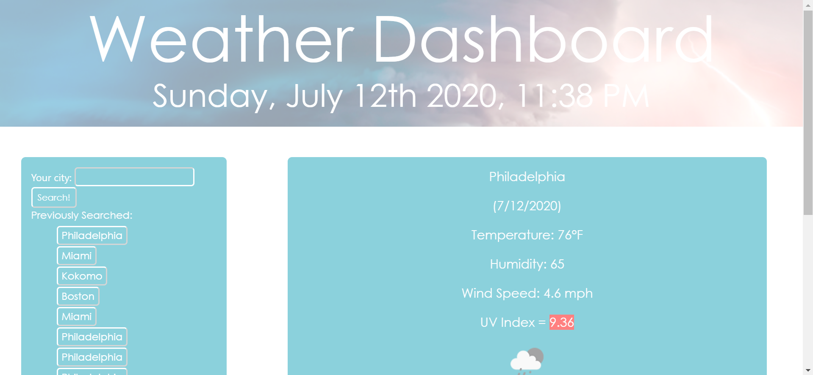
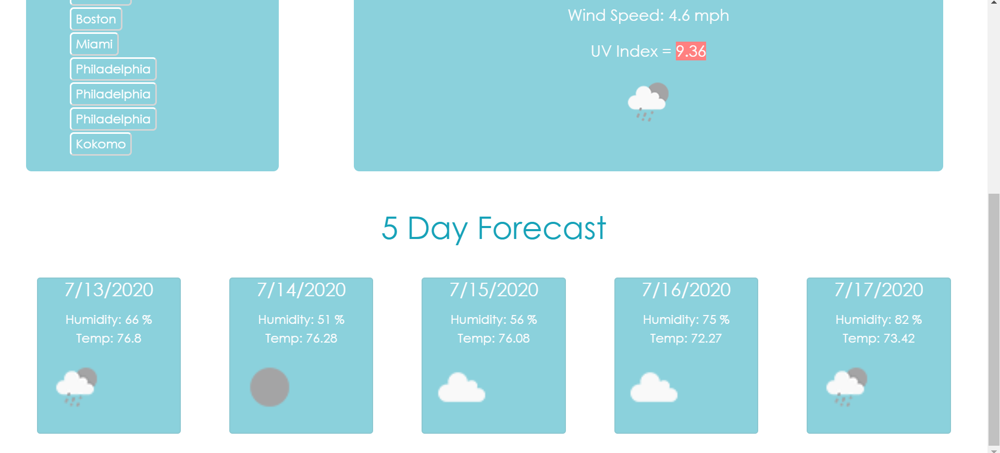

# Weather Dashboard

## Introduction
This application is a simple, user friendly way to check the weather in any City!  Persistent data hangs on to the user's previously searched cities, so that the user can quickly revisit their favorite locations.  

## Explanation
Simply type the city name of your choosing into the search bar and click the search button.  You will see to the side, the current weather conditions in that location to include name of city, date, temperature, humidity, wind speed, UV index, and visual icon.  The UV index will change colors according to the severity of the weather conditions.  Below, the user will find the five day forecast for this location.  The five day forecast includes humidity, temperature, and a visual icon.  When the user clicks on a city in the previously searched column, the user will see updated weather conditions for that city.

## Languages Used
* HTML
* CSS
* JavaScript

## Contributions
Melanie Gilman

## Deployed Link
https://melaniegilman.github.io/weather-app/

## Screenshots
 
 

